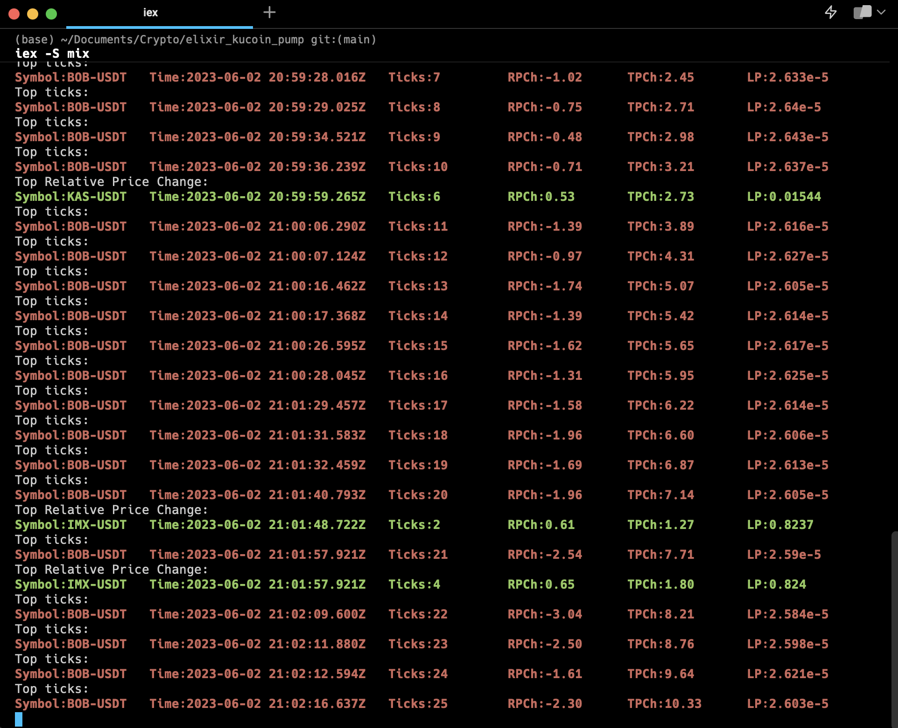

# KucoinPump

Kucoin Pump Detector 

Based on the project made by [ogu83](https://github.com/ogu83) : [https://github.com/ogu83/binancePump](https://github.com/ogu83/binancePump)

## What is this?

Creates a kucoin web socket and listen for trades. Aggragetes information, groups trade information via price, ticks and volume.
prints out at the time interval most traded, price changed and volume changed symbol.
This information could be detected an anomaly. An anomaly in kucoin could be leading to pump or dump.

Also it is working as a telegram bot here https://t.me/KucoinPump_Bot

## How to run

```shell
git clone https://github.com/rsilvestre/kucoin_pump.git
```

## Installation

### Install Elixir

Just follow that tutorial [https://elixir-lang.org/install.html](https://elixir-lang.org/install.html)

Install hex :

```shell
mix local.hex
```

Install deps :

```shell
mix deps.get
```

Compile :

```shell
mix compile
```

### Configuration

Rename .secrets_example.exs into .secrets.exs

Edit .secrets.exs

### Run Application

```shell
iex -S mix
```

## Screen Shot


